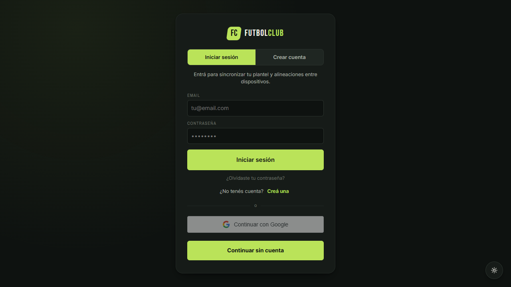
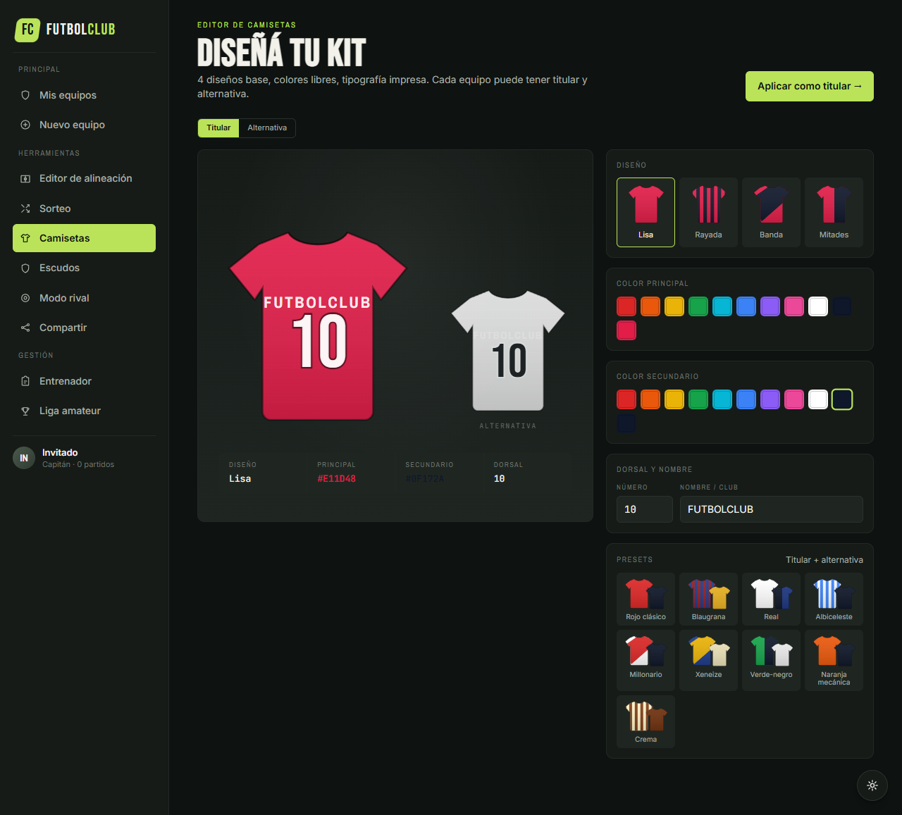
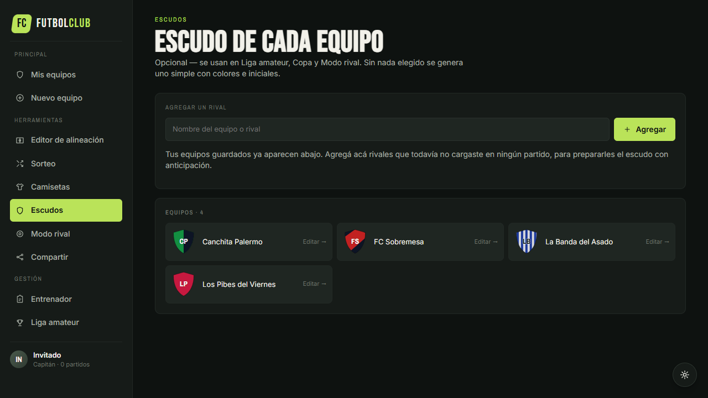
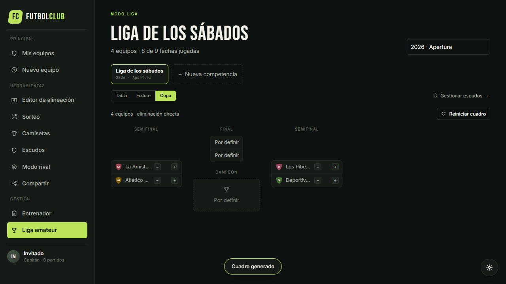

# futbolClub

Aplicación web para crear alineaciones de fútbol, organizar planteles y sorteos, registrar el seguimiento de jugadores y administrar competencias amateur (ligas y copas).

[](LICENSE)
[](https://github.com/viceKDK/futLineUp/tree/main)
[](tests/)


## Descripción

futbolClub reúne tres experiencias dentro de una misma aplicación:

- **Amigos:** creación de equipos, formaciones, sorteos, camisetas, escudos y contenido para compartir.
- **Entrenador:** fichas de jugadores, entrenamientos, asistencia, evaluaciones y objetivos.
- **Liga amateur:** múltiples competencias en paralelo (ligas y copas), calendario, resultados, tabla de posiciones y cuadros de eliminación directa.

La aplicación funciona en modo invitado con persistencia local: crear una cuenta nunca bloquea el editor, el sorteo ni los enlaces compartidos. La autenticación (email/contraseña o Google) y la sincronización entre dispositivos pueden habilitarse opcionalmente mediante Supabase.

## Funcionalidades principales

### Cuenta

- Pantalla de login/registro en la primera visita, con email/contraseña, Google y recuperar contraseña.
- Botón "Continuar sin cuenta" siempre disponible — no es obligatorio crear una cuenta para nada.
- Acceso posterior a "Cuenta y datos" desde el ícono de perfil en la barra lateral.

### Equipos y alineaciones

- Modalidades Fut 5, 6, 7, 8 y 11.
- Formaciones predefinidas y posicionamiento libre.
- Arrastre por eventos de puntero (confiable en mouse, trackpad y touch, sin depender del drag-and-drop nativo del navegador) y asignación mediante click o toque.
- Titulares, suplentes y capitán.
- Fotos, dorsales, posiciones y pierna hábil.
- Guardado y reapertura completa de cada alineación.

### Organización

- Sorteo balanceado de dos, tres o cuatro equipos, con arrastre entre equipos y "Sorteo desde 0" para armar planteles temporales sin tocar el plantel real.
- Registro de partidos, resultados y goleadores.
- Diseño de camisetas: titular y alternativa por equipo, 4 diseños base, presets con colores a juego, contraste automático del dorsal según el color de la camiseta.
- Escudos de equipo opcionales: generados automáticamente con colores e iniciales, foto propia, letras editables, o sin escudo — con su propio editor visual y presets.
- Vista de formación propia contra rival, con escudos en el enfrentamiento.
- Backup e importación JSON.
- Carga rápida de planteles desde texto.

### Entrenador

- Fichas individuales de jugadores.
- Sesiones de entrenamiento y asistencia.
- Evaluaciones por entrenamiento o partido.
- Fortalezas, aspectos por mejorar y próximos objetivos.
- Historial básico de evolución.

### Liga amateur

- Múltiples competencias en paralelo (Apertura, Clausura, copas amistosas, distintas temporadas), cada una con su propia tabla, fixture y cuadro de copa.
- Calendario de partidos con filtro por rango de fechas.
- Registro de resultados y tabla automática con puntos y diferencia de gol.
- Cuadro de eliminación directa (Copa) de 4 a 32 equipos, con definición por penales en caso de empate.
- Autocompletado de nombres de equipo a partir de los equipos guardados.

### Compartir y exportar

- Diseños Card, Lista y Stories 9:16.
- Exportación PNG, PDF e ICS.
- Enlaces autocontenidos con la alineación.
- WhatsApp, Telegram, Instagram, X y Web Share API.

### Instalación y modo offline

- Manifest e icono para instalar futbolClub como aplicación.
- Shell local disponible con conexión limitada después de la primera carga.
- Aviso en la app cuando hay una versión nueva disponible para actualizar.
- Cuenta opcional: los datos del invitado permanecen en su dispositivo.
- Cobertura E2E del modo Libre guardado y compartido en un navegador limpio.

## Capturas

| Login / registro | Camisetas | Escudos | Liga: Copa | Entrenador |
|---|---|---|---|---|
| [](screenshots/12-auth.png) | [](screenshots/05-kits.png) | [](screenshots/05b-crests.png) | [](screenshots/10c-league-cup.png) | [](screenshots/09-coach.png) |

La galería completa (más de 15 pantallas y estados de la app) está disponible en [screenshots/README.md](screenshots/README.md).

## Ejecución local

Requisitos:

- Node.js 18 o superior.
- npm.
- Chrome y Edge para ejecutar las pruebas Playwright configuradas en el proyecto (`chromium` y `msedge`).

```powershell
npm install
npm run serve
```

Abrir `http://localhost:8765/futbolClub.html`.

La aplicación principal no requiere compilación: React y Babel se cargan en el navegador. npm se utiliza para el servidor local, las pruebas y la generación de capturas.

## Scripts

```powershell
npm run serve             # servidor local en el puerto 8765
npm test                  # suite completa de Playwright (Chrome)
npm run test:edge         # suite completa en Edge (chequeo cross-browser)
npm run test:headed       # pruebas con navegador visible
npm run screenshots       # regenera la galería de capturas desktop
npm run screenshots:mobile  # capturas a ancho de teléfono (390×844)
```

## Supabase y Google Login

La nube es opcional. Sin configuración externa, futbolClub continúa funcionando con `localStorage` y el botón "Continuar sin cuenta".

Para habilitar autenticación y sincronización:

1. Crear un proyecto en Supabase.
2. Ejecutar [supabase/schema.sql](supabase/schema.sql) en el SQL Editor.
3. Habilitar Google (y/o email/contraseña) como proveedor de autenticación.
4. Copiar `src/local-config.example.js` como `src/local-config.js`.
5. Completar la URL y la clave pública `anon` del proyecto.

`src/local-config.js` está ignorado por Git. No deben guardarse secretos ni claves privadas en el repositorio.

## Tecnologías

- React 18 mediante UMD.
- Babel Standalone para JSX en navegador.
- SVG para cancha, camisetas y escudos.
- html2canvas y jsPDF para exportaciones.
- localStorage para el modo local.
- Service Worker y Web App Manifest para instalación, uso con conexión limitada y aviso de actualización.
- Supabase Auth, PostgreSQL y Storage como backend opcional.
- Playwright para pruebas E2E y capturas.

## Estructura del proyecto

```text
futLineUp/
├── futbolClub.html
├── service-worker.js
├── src/
│   ├── data.jsx
│   ├── icons.jsx
│   ├── pitch.jsx
│   ├── kits.jsx
│   ├── sidebar.jsx
│   ├── supabase.jsx
│   ├── page-auth.jsx
│   ├── page-home.jsx
│   ├── page-mode.jsx
│   ├── page-editor.jsx
│   ├── page-draw.jsx
│   ├── page-kits.jsx
│   ├── page-crests.jsx
│   ├── page-rival.jsx
│   ├── page-share.jsx
│   └── page-platform.jsx
├── supabase/
│   └── schema.sql
├── tests/
├── screenshots/
├── marketing/
└── docs/
```

## Documentación

- [Plan de implementación](docs/PLAN_IMPLEMENTACION.md)
- [Estado actual](docs/ESTADO_IMPLEMENTACION.md)
- [Galería de capturas](screenshots/README.md)
- [Piezas de marketing](marketing/README.md)
- [Futuras consideraciones a implementar](futuras-consideraciones-a-implementar.md)

## Licencia

Este proyecto se distribuye bajo la [Licencia MIT](LICENSE).
