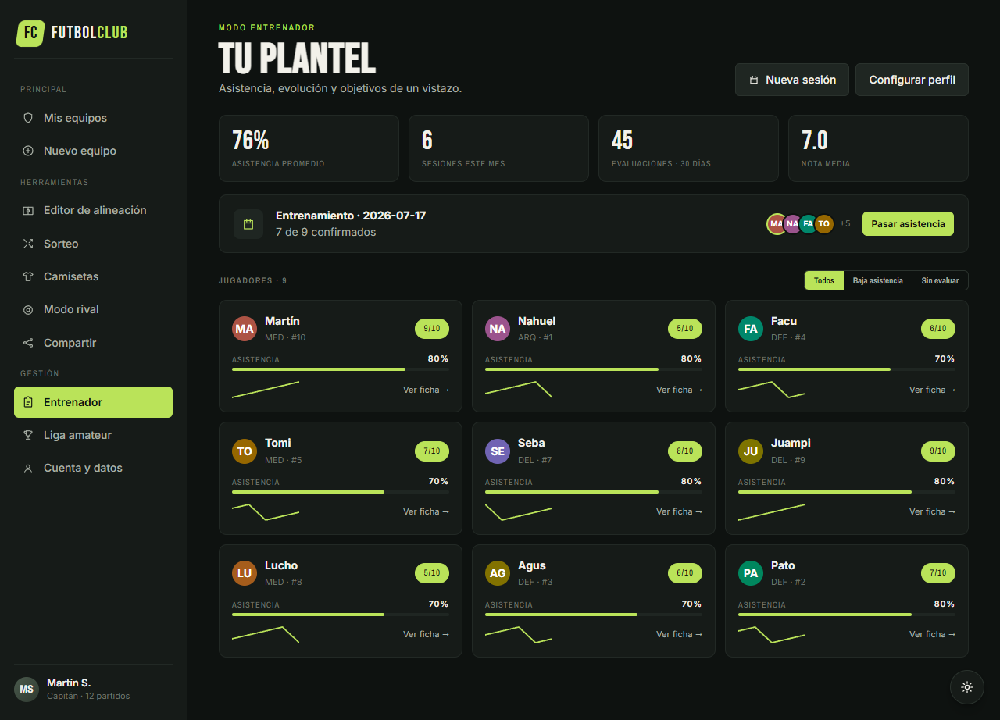
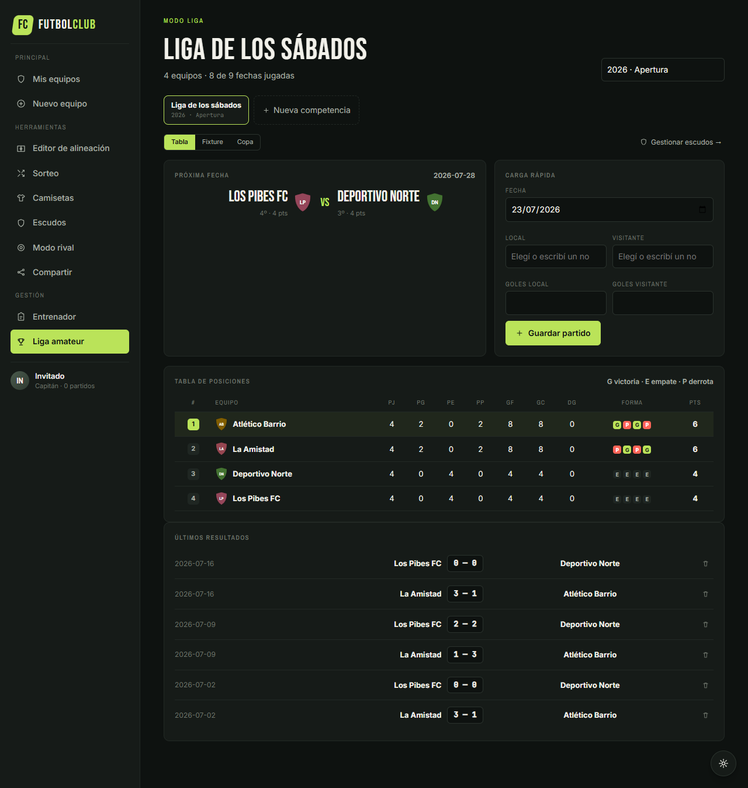
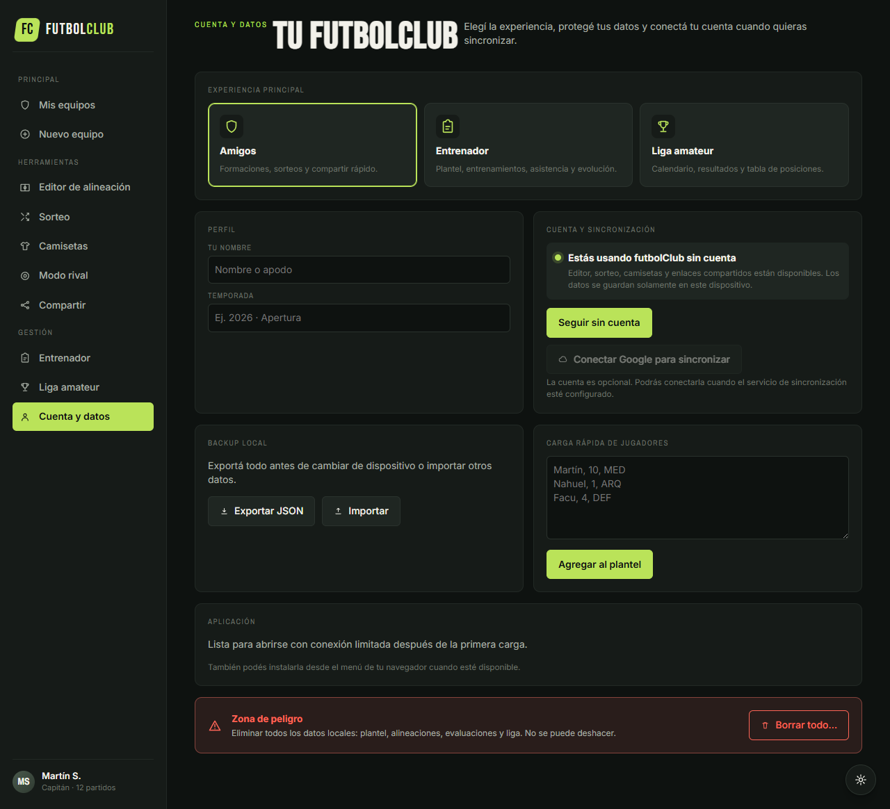

# futbolClub

Aplicación web para crear alineaciones de fútbol, organizar planteles y sorteos, registrar el seguimiento de jugadores y administrar competencias amateur.

[](LICENSE)
[](https://github.com/viceKDK/futLineUp/tree/develop)
[](tests/)


## Descripción

futbolClub reúne tres experiencias dentro de una misma aplicación:

- **Amigos:** creación de equipos, formaciones, sorteos, camisetas y contenido para compartir.
- **Entrenador:** fichas de jugadores, entrenamientos, asistencia, evaluaciones y objetivos.
- **Liga amateur:** calendario, resultados y tabla de posiciones.

La aplicación funciona en modo invitado con persistencia local. La autenticación con Google y la sincronización entre dispositivos pueden habilitarse opcionalmente mediante Supabase.

## Funcionalidades principales

### Equipos y alineaciones

- Modalidades Fut 5, 6, 7, 8 y 11.
- Formaciones predefinidas y posicionamiento libre.
- Drag and drop y asignación mediante click o toque.
- Titulares, suplentes y capitán.
- Fotos, dorsales, posiciones y pierna hábil.
- Guardado y reapertura completa de cada alineación.

### Organización

- Sorteo balanceado de dos, tres o cuatro equipos.
- Registro de partidos y resultados.
- Diseño de camisetas y presets de colores.
- Vista de formación propia contra rival.
- Backup e importación JSON.
- Carga rápida de planteles desde texto.

### Entrenador

- Fichas individuales de jugadores.
- Sesiones de entrenamiento y asistencia.
- Evaluaciones por entrenamiento o partido.
- Fortalezas, aspectos por mejorar y próximos objetivos.
- Historial básico de evolución.

### Liga amateur

- Calendario de partidos.
- Registro de resultados.
- Tabla automática con puntos y diferencia de gol.
- Gestión local de temporada y fixture.

### Compartir y exportar

- Diseños Card, Lista y Stories 9:16.
- Exportación PNG, PDF e ICS.
- Enlaces autocontenidos con la alineación.
- WhatsApp, Telegram, Instagram, X y Web Share API.

## Capturas

| Entrenador | Liga amateur | Cuenta y datos |
|---|---|---|
| [](screenshots/09-coach.png) | [](screenshots/10-league.png) | [](screenshots/11-settings.png) |

La galería completa está disponible en [screenshots/README.md](screenshots/README.md).

## Ejecución local

Requisitos:

- Node.js 18 o superior.
- npm.
- Chrome para ejecutar las pruebas Playwright configuradas en el proyecto.

```powershell
npm install
npm run serve
```

Abrir `http://localhost:8765/futbolClub.html`.

La aplicación principal no requiere compilación: React y Babel se cargan en el navegador. npm se utiliza para el servidor local, las pruebas y la generación de capturas.

## Scripts

```powershell
npm run serve        # servidor local en el puerto 8765
npm test             # suite completa de Playwright
npm run test:headed  # pruebas con navegador visible
npm run screenshots  # regenera la galería de capturas
```

Estado verificado en `develop`: **18 pruebas aprobadas**.

## Supabase y Google Login

La nube es opcional. Sin configuración externa, futbolClub continúa funcionando con `localStorage`.

Para habilitar autenticación y sincronización:

1. Crear un proyecto en Supabase.
2. Ejecutar [supabase/schema.sql](supabase/schema.sql) en el SQL Editor.
3. Habilitar Google como proveedor de autenticación.
4. Copiar `src/local-config.example.js` como `src/local-config.js`.
5. Completar la URL y la clave pública `anon` del proyecto.

`src/local-config.js` está ignorado por Git. No deben guardarse secretos ni claves privadas en el repositorio.

## Tecnologías

- React 18 mediante UMD.
- Babel Standalone para JSX en navegador.
- SVG para cancha y camisetas.
- html2canvas y jsPDF para exportaciones.
- localStorage para el modo local.
- Supabase Auth, PostgreSQL y Storage como backend opcional.
- Playwright para pruebas E2E y capturas.

## Estructura del proyecto

```text
futLineUp/
├── futbolClub.html
├── src/
│   ├── data.jsx
│   ├── pitch.jsx
│   ├── kits.jsx
│   ├── page-home.jsx
│   ├── page-mode.jsx
│   ├── page-editor.jsx
│   ├── page-draw.jsx
│   ├── page-kits.jsx
│   ├── page-rival.jsx
│   ├── page-share.jsx
│   ├── page-platform.jsx
│   └── supabase.jsx
├── supabase/
│   └── schema.sql
├── tests/
├── screenshots/
├── marketing/
└── docs/
```

## Documentación

- [Plan de implementación](docs/PLAN_IMPLEMENTACION.md)
- [Estado actual](docs/ESTADO_IMPLEMENTACION.md)
- [Galería de capturas](screenshots/README.md)
- [Piezas de marketing](marketing/README.md)

## Licencia

Este proyecto se distribuye bajo la [Licencia MIT](LICENSE).
