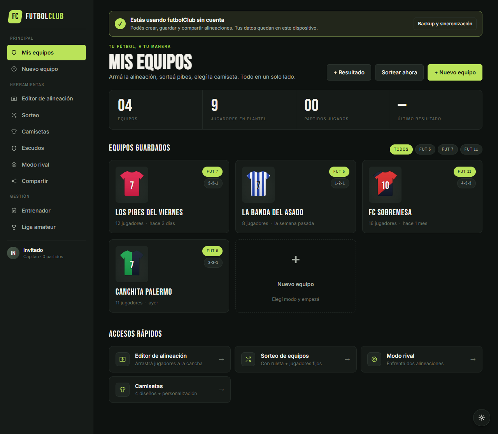

# futbolClub

App web para armar alineaciones de fútbol (Fut 5 / 6 / 7 / 8 / 11), sortear equipos, diseñar camisetas, enfrentar rivales y compartir la formación. En español rioplatense, estética editorial-deportiva, 100% client-side.



 

> Más capturas de cada pantalla en [`screenshots/`](screenshots/).

## Demo rápida

Abrí `futbolClub.html` en cualquier navegador moderno. No hay build step.

```bash
# opcional: servidor estático local
python -m http.server 8000
# luego abrí http://localhost:8000/futbolClub.html
```

## Pantallas

- **Mis equipos** — dashboard con equipos guardados, stats derivadas de partidos reales, filtros por modo y accesos rápidos.
- **Nuevo equipo** — selector de modo (5/6/7/8/11) + nombre.
- **Editor de alineación** — cancha SVG con drag & drop, formaciones predefinidas por modo, **modo libre** (arrastrás los círculos a cualquier punto), camiseta aplicada a los jugadores, auto-completar, subida de fotos por jugador, alta/baja de plantel.
- **Sorteo** — 2/3/4 equipos, fijar jugadores por equipo (🔒), ruleta animada "sortear uno", "sortear todos" balanceado.
- **Camisetas** — 4 diseños (lisa, rayada, banda, mitades), 10 swatches + color picker, dorsal y nombre, 8 presets (Blaugrana, Xeneize, Millonario, etc.).
- **Modo rival** — cancha completa con dos alineaciones encaradas, estilo previa de TV.
- **Compartir** — 3 formatos (Card / Lista / Stories 9:16), export **PNG / PDF / .ics** reales, deep-links a WhatsApp / Twitter / Telegram / Instagram, Web Share API nativa, toggles de "Incluir" que afectan el output.

## Features

- ✅ Drag & drop entre roster y cancha, swap entre posiciones, drop desde el plantel.
- ✅ Modo libre de formaciones (posiciones arbitrarias guardadas por combinación modo+formación).
- ✅ Subida real de fotos desde la galería (redimensionadas a 256px, guardadas como dataURL).
- ✅ Persistencia completa en `localStorage` (plantel, equipos, draft del editor, sorteo, rival, kit, partidos, tweaks visuales).
- ✅ Registro de partidos con resultados reales alimentando las stats del home.
- ✅ Export PNG (html2canvas) y PDF (jsPDF) a resolución 2×.
- ✅ Export .ics con la fecha/hora/cancha/rival del partido.
- ✅ Web Share API nativa (con archivo adjunto cuando el navegador lo permite).
- ✅ Tweaks visuales (estilo cancha: clásica/flat/noche · jugador en cancha: foto/camiseta · acento: lima/cyan/rojo) persistidos.

## Stack

- React 18 vía UMD
- Babel Standalone para compilar JSX en el navegador
- html2canvas 1.4.1 (export PNG/PDF)
- jsPDF 2.5.1 (export PDF)
- SVG puro para canchas y camisetas
- localStorage como backend

Sin bundler, sin build, sin dependencias `npm`. Todo corre abriendo el HTML.

## Estructura

```
futLineUp/
├── futbolClub.html          # shell: sidebar, router, tokens, fuentes, panel de tweaks
└── src/
    ├── data.jsx             # formaciones, roster default, persistencia (db + useStore)
    ├── kits.jsx             # <Kit> SVG (4 diseños) + KIT_DESIGNS
    ├── pitch.jsx            # <Pitch> SVG (drag&drop, modo libre, jugadores)
    ├── page-home.jsx        # Mis equipos + registro de partidos
    ├── page-mode.jsx        # Selector de modo + nombre
    ├── page-editor.jsx      # Editor de alineación + alta/foto de jugadores
    ├── page-draw.jsx        # Sorteo con ruleta
    ├── page-kits.jsx        # Diseñador de camisetas
    ├── page-rival.jsx       # Modo rival (cancha combinada)
    └── page-share.jsx       # Compartir + export PNG/PDF/ICS + redes
```

## Datos en localStorage

Todas las claves usan prefijo `fc.v1.`:

| Clave                | Contenido                                                |
|----------------------|----------------------------------------------------------|
| `fc.v1.roster`       | Plantel (nombre, dorsal, posición, foto base64)          |
| `fc.v1.teams`        | Equipos guardados                                        |
| `fc.v1.editor`       | Draft del editor (nombre, modo, formación, kit, asign.)  |
| `fc.v1.draw`         | Nº de equipos, asignaciones, lockeos del sorteo          |
| `fc.v1.rival`        | Modo/formaciones/kits del modo rival                     |
| `fc.v1.currentKit`   | Camiseta activa                                          |
| `fc.v1.matches`      | Historial de partidos (equipo, resultado, rival, fecha)  |
| `fc.v1.matchInfo`    | Fecha/hora/cancha/rival del próximo partido              |
| `fc.v1.shareInclude` | Toggles del share (nombres, kit, venue, stats, wm)       |
| `fc.v1.tweaks`       | Ajustes visuales (pitchStyle, playerStyle, accent)       |

## Origen

Diseñado en [claude.ai/design](https://claude.ai/design) y exportado como handoff bundle. Implementación pixel-perfect del prototipo original + toda la lógica de backend client-side para dejarlo full funcional.
