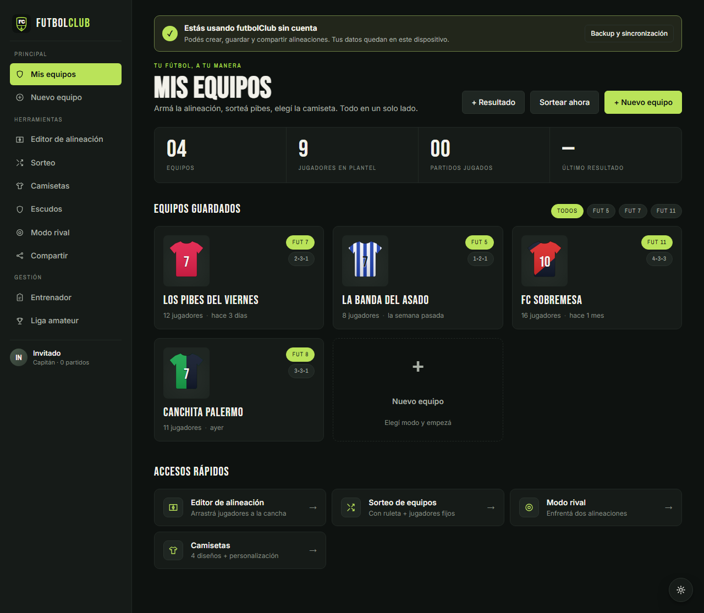

# futbolClub

Aplicación web para crear alineaciones de fútbol, organizar planteles y sorteos, registrar el seguimiento de jugadores y administrar competencias amateur. El modo invitado funciona con persistencia local; cuenta y sincronización mediante Supabase son opcionales.



## Desarrollo y calidad

Usar Node de `.nvmrc` (22.16.0) y npm. Las pruebas del núcleo no requieren descargar dependencias:

```sh
npm test
npm run quality:core
```

Para compilar, servir y ejecutar la aplicación completa:

```sh
npm ci
npm run serve
```

Abrir `http://localhost:8765/futbolClub.html`. `preserve` compila el JSX antes de iniciar el servidor. Las bibliotecas de ejecución se conservan en `vendor/`; el navegador no compila JSX.

```sh
npm run test:unit           # pruebas rápidas y contratos sin navegador
npm run test:architecture   # fronteras, ciclos e inventario offline
npm run test:coverage       # umbrales 95% líneas / 90% ramas / 95% funciones del núcleo
npm run test:functional     # build + selección de pruebas Chromium
npm run test:e2e            # suite Playwright y sus proyectos configurados
npm run test:edge           # compatibilidad con Edge instalado
npm run test:headed         # navegador visible
npm run lint
npm run format:check
npm run format
npm run quality            # formato + lint + arquitectura + coverage + funcional
npm run security:audit     # auditoría de dependencias, separada de FIRST
npm run build:client
npm run vendor:sync
npm run screenshots
npm run screenshots:mobile
```

**Cambio de comando:** `npm test` ejecuta ahora la suite unitaria. La antigua ejecución de Playwright está en `npm run test:e2e`. Instalar los navegadores de Playwright/Edge correspondientes para esa suite. No confundir el porcentaje del núcleo con cobertura de todas las pantallas.

## Arquitectura

```text
src/
├── app/                       # composición y puente de compatibilidad
├── features/
│   ├── backup/                # domain + application
│   ├── lineup/                # domain + presentation
│   ├── draw/                  # domain + presentation
│   ├── sharing/               # application + presentation
│   ├── auth/                  # infrastructure + presentation
│   ├── teams/                 # presentation
│   ├── kits/                  # presentation
│   ├── crests/                # presentation
│   ├── rival/                 # presentation
│   ├── settings/              # presentation
│   ├── coach/                 # presentation
│   └── league/                # presentation
├── shared/
│   ├── domain/
│   ├── application/
│   ├── infrastructure/
│   └── presentation/
└── bootstrap.js, auto-backup.js, observability.js, configuración y promo heredados
scripts/                       # build, inventario, controles y release
compiled/                      # salidas estables y manifiesto offline generado
tests/
├── unit/
├── contracts/
├── architecture/
└── *.spec.js                  # integración y E2E existentes
supabase/                      # esquema, migraciones y verificación de seguridad
docs/
```

El antiguo `data.jsx` se divide en reglas puras, casos de uso, adaptadores y presentación. Las pantallas JSX se agrupan por funcionalidad y mantienen sus APIs mediante `src/app/legacy-bridge.js`. Esto es una migración progresiva: las pantallas grandes, el scheduler automático y la integración cloud aún tienen deuda explícita.

El manifiesto `scripts/client-entries.mjs` resuelve las rutas nuevas sin cambiar las URLs compiladas de las pantallas. La entrada de datos usa ES Modules; sus consumidores clásicos esperan con `defer`. El service worker incluye automáticamente los módulos nuevos mediante `compiled/module-precache.js`. Publicar fuentes, compilados y service worker juntos.

Detalles: [Arquitectura y OCP](docs/ARCHITECTURE.md), [FIRST y coverage](docs/TESTING.md), [validación de esta migración](docs/VALIDATION_ARCHITECTURE.md) y [contribuciones](CONTRIBUTING.md).

## Funcionalidades del producto

**Amigos y alineaciones:** modalidades Fut 5, 6, 7, 8 y 11, formaciones y posiciones libres, arrastre por puntero, titulares, suplentes, capitán, fotos, dorsales y pierna hábil. Guardado/reapertura de equipos y carga rápida de planteles desde texto.

**Organización:** sorteo balanceado de dos a cuatro equipos, sorteo temporal desde cero, registro de partidos/resultados/goleadores, camisetas titular y alternativa con cuatro diseños base, presets y contraste del dorsal. Escudos automáticos, foto propia, letras editables o sin escudo. Comparación contra rival.

**Entrenador:** fichas individuales, sesiones, asistencia, evaluaciones, fortalezas, objetivos e historial básico de evolución.

**Liga amateur:** múltiples competencias y temporadas, fixture, calendario filtrable, resultados, tabla automática y copas de 4 a 32 equipos con penales. Nombres de equipos autocompletados desde los guardados.

**Compartir:** diseños Card, Lista y Stories 9:16, PNG, PDF, ICS, enlaces autocontenidos, WhatsApp, Telegram, Instagram, X y Web Share API. Backups JSON y recuperación. El modo local continúa disponible sin crear una cuenta.

**PWA:** manifest, icono, shell offline tras la primera carga y aviso de nueva versión. El funcionamiento offline depende de publicar también todos los módulos de `src/` que importa la entrada de datos.

## Cuenta opcional y Supabase

Se conserva login/registro, Google, recuperación de contraseña y el botón de continuar sin cuenta. Sin configuración externa, la app usa almacenamiento local.

Para habilitar la nube, crear un proyecto Supabase, ejecutar [el esquema](supabase/schema.sql), aplicar las migraciones correspondientes de `supabase/migrations/` y habilitar los proveedores de autenticación. Copiar `src/local-config.example.js` a `src/local-config.js` y completar la URL y clave pública `anon`. Nunca guardar claves privadas en el repositorio.

Verificar seguridad con `supabase/verify-security.sql`. La integración real es optativa:

```powershell
$env:SUPABASE_TEST_URL="https://proyecto-de-staging.supabase.co"
$env:SUPABASE_TEST_ANON_KEY="clave-anon-de-staging"
$env:SUPABASE_TEST_EMAIL="usuario-pruebas@example.com"
$env:SUPABASE_TEST_PASSWORD="contraseña-de-pruebas"
npm run test:supabase
```

Esta prueba modifica datos y restaura el backup previo de ese usuario. **Nunca apuntarla a producción.** No forma parte del circuito FIRST ni es necesaria para usar la aplicación como invitado.

## Documentación y capturas

[Plan de implementación](docs/PLAN_IMPLEMENTACION.md) · [Estado del producto](docs/ESTADO_IMPLEMENTACION.md) · [Futura aplicación móvil](docs/ARQUITECTURA_MOVIL.md) · [Galería de capturas](screenshots/README.md) · [Marketing](marketing/README.md) · [Consideraciones futuras](futuras-consideraciones-a-implementar.md).

Tecnologías: React 18, Babel, SVG, html2canvas, jsPDF, almacenamiento local, Service Worker y Supabase opcional. Pruebas nativas Node y Playwright.

## Licencia

[MIT](LICENSE).
