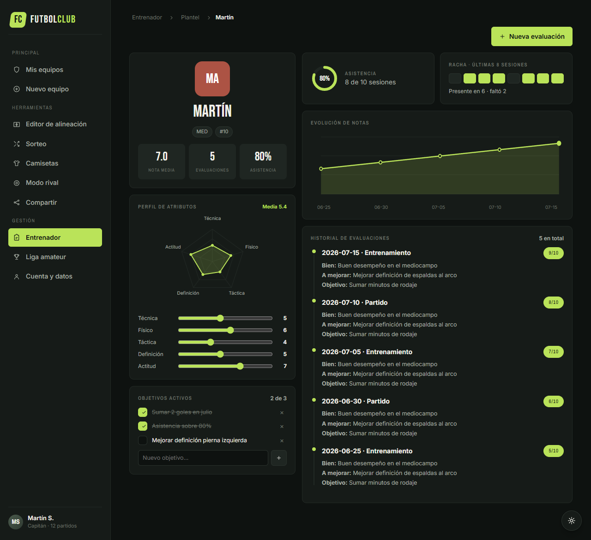
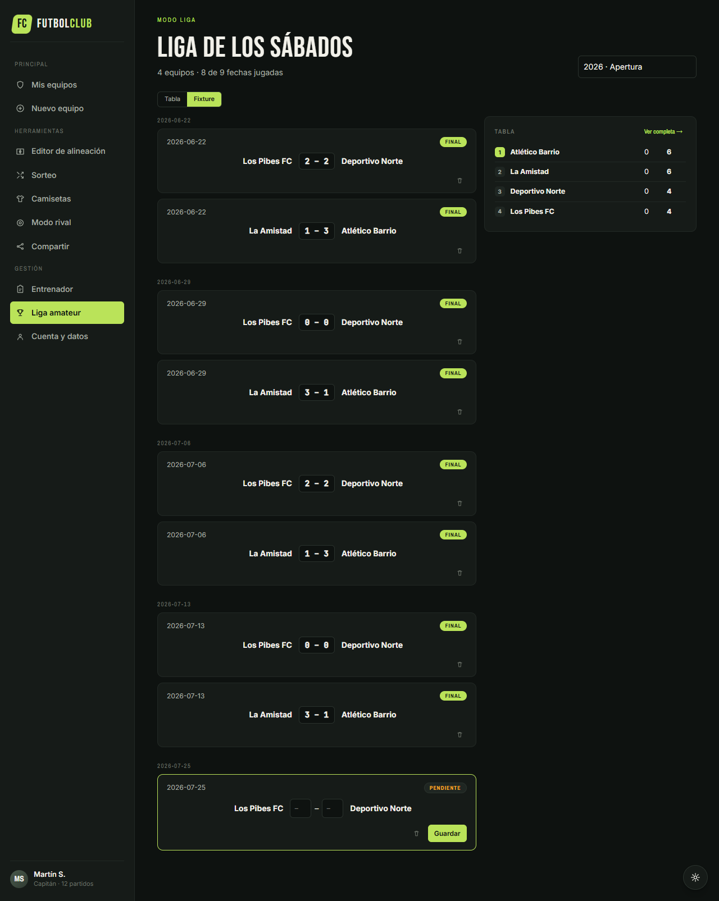

# Capturas de futbolClub

Capturas generadas automáticamente con Playwright desde la rama `develop`. Todas las pantallas principales y los estados especiales relevantes quedan cubiertos por `tests/screenshots.spec.js`.

| # | Archivo | Pantalla o estado |
|---|---|---|
| 01 | [`01-home.png`](01-home.png) | Mis equipos y resumen general |
| 02 | [`02-mode.png`](02-mode.png) | Creación de equipo y selector Fut 5/6/7/8/11 |
| 03 | [`03-editor.png`](03-editor.png) | Editor de alineación vacío |
| 03b | [`03b-editor-autocompletado.png`](03b-editor-autocompletado.png) | Editor autocompletado |
| 04 | [`04-draw.png`](04-draw.png) | Sorteo inicial |
| 04b | [`04b-draw-sorteado.png`](04b-draw-sorteado.png) | Equipos sorteados y balanceados |
| 05 | [`05-kits.png`](05-kits.png) | Diseñador de camisetas |
| 06 | [`06-rival.png`](06-rival.png) | Modo rival |
| 07 | [`07-share.png`](07-share.png) | Compartir y exportar |
| 08 | [`08-tweaks.png`](08-tweaks.png) | Ajustes visuales |
| 09 | [`09-coach.png`](09-coach.png) | Entrenador: plantel, asistencia y evaluaciones de un vistazo |
| 09b | [`09b-coach-ficha.png`](09b-coach-ficha.png) | Entrenador: ficha del jugador (radar de atributos, objetivos, evolución de notas) |
| 10 | [`10-league.png`](10-league.png) | Liga amateur: tabla de posiciones con forma reciente |
| 10b | [`10b-league-fixture.png`](10b-league-fixture.png) | Liga amateur: fixture por fecha con carga de resultados inline |
| 11 | [`11-settings.png`](11-settings.png) | Perfil, Google/Supabase, backup, importación y zona de peligro |

## Nuevos módulos

### Entrenador




### Liga amateur




### Cuenta y datos


## Mobile (390×844)

`tests/screenshots-mobile.spec.js` repite las pantallas clave a ancho de teléfono, en [`mobile/`](mobile/):

| Archivo | Pantalla |
|---|---|
| [`mobile/01-home.png`](mobile/01-home.png) | Mis equipos |
| [`mobile/09-coach.png`](mobile/09-coach.png) | Entrenador: plantel |
| [`mobile/09b-coach-ficha.png`](mobile/09b-coach-ficha.png) | Entrenador: ficha del jugador |
| [`mobile/10-league.png`](mobile/10-league.png) | Liga amateur: tabla |
| [`mobile/10b-league-fixture.png`](mobile/10b-league-fixture.png) | Liga amateur: fixture por fecha |
| [`mobile/11-settings.png`](mobile/11-settings.png) | Cuenta y datos |

En ancho mobile la sidebar pasa a una barra horizontal con scroll (`@media max-width:900px`); al navegar a una sección, el navegador hace scroll automático para mostrar el botón activo, por lo que las capturas pueden no arrancar mostrando el primer ítem del menú — es el comportamiento esperado, no un bug.

## Cross-browser (Chrome vs. Edge)

`tests/screenshots.spec.js` corre también contra Microsoft Edge (`channel: msedge`) y escribe en [`msedge/`](msedge/) en lugar de pisar la galería de Chrome, para poder comparar el render entre navegadores a simple vista.

## Regeneración

```powershell
npm.cmd run screenshots         # desktop, Chrome -> screenshots/
npm.cmd run screenshots:mobile  # mobile 390x844 -> screenshots/mobile/
npx playwright test tests/screenshots.spec.js --project=msedge  # Edge -> screenshots/msedge/
```

La configuración de Playwright usa Chrome (canal `chrome`) como proyecto por defecto y agrega un proyecto `msedge` (canal `msedge`) para el chequeo cross-browser. El test siembra datos de demo (plantel, asistencia, evaluaciones y fixture) antes de capturar, y también regenera los estados `03b`, `04b`, `08`, `09b` y `10b`, evitando que queden capturas antiguas mezcladas con las nuevas.